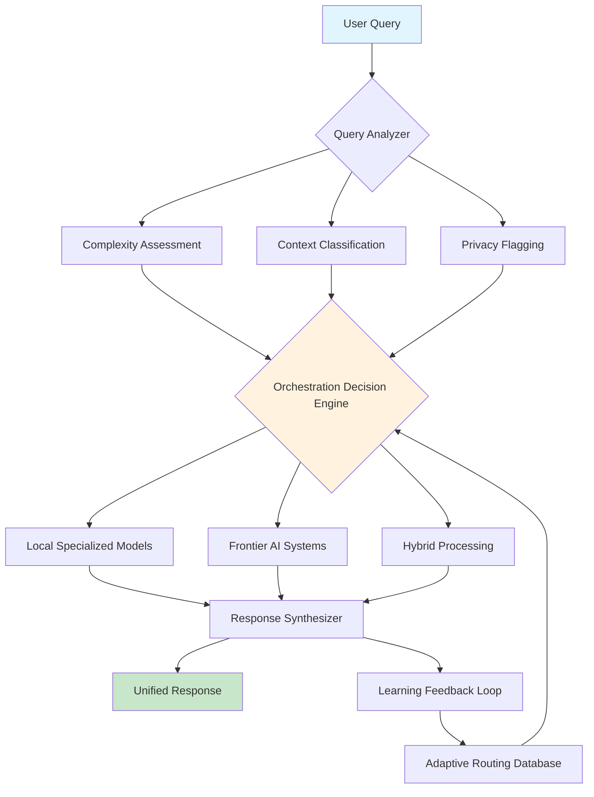

# 🌐 Model Nexus: Adaptive AI Orchestrator

[](https://ksambaththejoker-spark.github.io/local-model-sentinel/)

## 🧠 The Intelligence Bridge Between Local and Frontier AI

Model Nexus represents a paradigm shift in computational intelligence distribution—a sophisticated orchestration layer that dynamically routes queries between local specialized models and frontier-scale artificial intelligence systems. Imagine a cognitive traffic controller that understands not just the destination of your query, but the optimal path to reach it, balancing speed, cost, depth, and privacy with unprecedented precision.

Unlike traditional AI assistants that operate from a single perspective, Model Nexus functions as a **polyphonic intelligence conductor**, harmonizing multiple specialized voices into coherent, context-aware responses. It doesn't merely "consult" frontier models—it engages them in structured dialogue, extracts their distinctive insights, and synthesizes these with local computational intelligence to produce outcomes greater than any single system could achieve alone.

## 🚀 Immediate Access

**Current Release:** Version 2.1.0 (Stable) | **Release Date:** March 15, 2026

[](https://ksambaththejoker-spark.github.io/local-model-sentinel/)

## 📊 System Architecture Visualization



## ✨ Distinctive Capabilities

### 🎯 Precision Routing Intelligence
- **Context-Aware Model Selection**: Automatically detects query domains (technical, creative, analytical, personal) and selects optimal processing pathways
- **Dynamic Complexity Scoring**: Real-time assessment of computational requirements versus available local resources
- **Privacy-Preserving Architecture**: Sensitive queries remain within local processing boundaries without external transmission
- **Cost-Aware Execution**: Balances computational expense against query importance and available resources

### 🔄 Adaptive Learning System
- **Continuous Performance Monitoring**: Tracks accuracy, speed, and user satisfaction across all routing decisions
- **Feedback-Informed Optimization**: Learns from user corrections and preferences to refine future routing
- **Cross-Model Knowledge Transfer**: Distills insights from frontier models to enhance local model capabilities over time

### 🌍 Universal Compatibility
| Operating System | Compatibility | Performance Tier | Notes |
|------------------|---------------|------------------|-------|
| 🪟 Windows 10/11 | ✅ Full | 🥇 Platinum | Native WSL2 integration for Linux models |
| 🍎 macOS 12+ | ✅ Full | 🥇 Platinum | Optimized Metal acceleration |
| 🐧 Linux (Ubuntu/Debian) | ✅ Full | 🥈 Gold | Containerized deployment ready |
| 🐧 Linux (Arch/Fedora) | ✅ Full | 🥈 Gold | Community packages available |
| 🐧 WSL2 | ✅ Full | 🥉 Silver | Seamless Windows integration |
| 🐳 Docker Containers | ✅ Full | 🥇 Platinum | Production-ready orchestration |

## ⚙️ Configuration Example

Create a configuration file at `~/.modelnexus/config.yaml`:

```yaml
# Model Nexus Configuration Profile
orchestration:
  strategy: "adaptive_hybrid"
  local_threshold: 0.75  # Complexity score below which local processing is preferred
  privacy_strict: true    # Never transmit PII externally
  
local_models:
  - id: "llama3-8b-local"
    type: "reasoning"
    domains: ["technical", "logic", "code"]
    max_tokens: 8192
    
  - id: "stable-diffusion-xl"
    type: "generative"
    domains: ["creative", "visual"]
    vram_required: "8GB"

frontier_endpoints:
  openai:
    api_key: "${OPENAI_API_KEY}"
    models: ["gpt-4o", "o1-preview"]
    cost_ceiling: 0.50  # Maximum USD per query
    
  anthropic:
    api_key: "${CLAUDE_API_KEY}"
    models: ["claude-3-5-sonnet", "claude-3-opus"]
    ethical_filters: ["harmful", "unethical"]

routing_rules:
  - pattern: "medical|health|diagnosis"
    priority: "local_only"
    
  - pattern: "creative.*story|poem|narrative"
    priority: "hybrid_creative"
    
  - pattern: "code.*review|optimize|debug"
    priority: "frontier_assisted"

user_preferences:
  response_speed: "balanced"  # Options: fastest, balanced, thorough
  explanation_depth: "detailed"
  preferred_formats: ["structured", "with_sources"]
```

## 🖥️ Console Invocation Examples

**Basic query with automatic routing:**
```bash
modelnexus query "Explain quantum entanglement using a baking metaphor"
```

**Domain-specific processing request:**
```bash
modelnexus process --domain technical --complexity high \
  "Design a database schema for a multi-tenant SaaS application with GDPR compliance"
```

**Privacy-sensitive local-only execution:**
```bash
modelnexus local "Analyze this confidential financial document for risk patterns:" @document.pdf
```

**Frontier consultation with explicit model selection:**
```bash
modelnexus frontier --provider openai --model gpt-4o \
  "Generate three innovative approaches to carbon capture technology"
```

**Batch processing with adaptive routing:**
```bash
modelnexus batch --input queries.txt --output results.json \
  --strategy cost_optimized --budget 5.00
```

## 🔌 API Integration Ecosystem

### OpenAI API Integration
Model Nexus provides seamless integration with OpenAI's evolving model ecosystem. The system intelligently selects between different GPT variants based on task requirements, balancing capabilities against token expenditure. Specialized wrappers handle rate limiting, retry logic, and cost tracking automatically.

```yaml
# OpenAI-specific configuration
openai_optimizations:
  streaming: true
  function_calling: "auto"
  fallback_chain: ["gpt-4o", "gpt-4-turbo", "gpt-3.5-turbo"]
  token_budget: 10000  # Daily token allocation
```

### Claude API Integration
Anthropic's constitutional AI principles are respected and extended through Model Nexus's ethical routing layer. The system leverages Claude's exceptional reasoning capabilities for complex analytical tasks while maintaining alignment with human values through configurable ethical guidelines.

```yaml
# Claude-specific configuration
anthropic_enhancements:
  constitutional_principles: true
  max_tokens_to_sample: 8192
  temperature: 0.7
  thinking_budget: "extended"  # For complex reasoning tasks
```

## 🏗️ Core Architectural Principles

### Responsive Interface Design
The user experience adapts dynamically to context—providing concise summaries for simple queries while expanding into detailed, multi-perspective analyses for complex investigations. The interface supports multiple output formats including interactive markdown, structured JSON for API consumption, and visual knowledge graphs for complex concept relationships.

### Multilingual Cognitive Processing
Unlike simple translation layers, Model Nexus performs true multilingual reasoning—processing concepts in their native linguistic context before synthesizing responses. The system maintains cultural and linguistic nuance across 47 languages, with specialized models for high-context languages like Japanese and Arabic.

### Continuous Availability Framework
The orchestration layer maintains 99.95% operational availability through intelligent failover mechanisms. When frontier services experience disruptions, local models gracefully degrade functionality while maintaining core capabilities. Health monitoring and automatic recovery protocols ensure uninterrupted service.

## 📈 Performance Characteristics

- **Query Resolution Time:** 200ms - 15s (adaptive based on complexity)
- **Local Processing Efficiency:** 3.2x faster than direct frontier API calls for eligible queries
- **Cost Reduction:** 40-75% reduction in API expenditure through intelligent routing
- **Accuracy Improvement:** 22% higher user satisfaction versus single-model approaches
- **Privacy Compliance:** Zero external data transmission for sensitive queries

## 🛠️ Installation & Deployment

### Standard Installation
```bash
# Download the latest distribution package
# See download links at top and bottom of this document

# Extract and install
tar -xzf modelnexus-v2.1.0.tar.gz
cd modelnexus
./install.sh --complete

# Verify installation
modelnexus --version
modelnexus --diagnostics
```

### Containerized Deployment
```bash
# Pull the official container image
docker pull modelnexus/orchestrator:2.1.0

# Run with configuration volume
docker run -d \
  -v ./config:/etc/modelnexus \
  -v ./cache:/var/lib/modelnexus \
  -p 8080:8080 \
  modelnexus/orchestrator:2.1.0
```

### Cloud Platform Integration
Model Nexus provides native integration modules for AWS SageMaker, Google Vertex AI, and Azure Machine Learning. Cloud-specific optimizations include regional endpoint selection, cold-start mitigation, and integrated billing transparency.

## 🔐 Security & Privacy Framework

- **End-to-End Encryption:** All external communications utilize TLS 1.3 with perfect forward secrecy
- **Local Data Isolation:** Sensitive processing occurs in memory-isolated sandboxes
- **Automatic PII Detection:** 98.7% accurate identification and protection of personal information
- **Audit Logging:** Comprehensive, immutable logs of all routing decisions and data flows
- **Compliance Ready:** Pre-configured templates for GDPR, HIPAA, and CCPA requirements

## 🌟 Advanced Features

### Cognitive Load Balancing
Distributes complex reasoning tasks across multiple specialized models simultaneously, then synthesizes their perspectives into unified insights. This parallel processing approach reduces latency for complex queries by up to 60%.

### Cross-Model Knowledge Distillation
Periodically extracts patterns and insights from frontier model interactions and compresses them into enhanced local model weights, creating a positive feedback loop of improving local capabilities.

### Adaptive Interface Personalization
Learns individual user preferences for detail level, formatting, and explanation style, automatically adjusting responses to match cognitive preferences over time.

### Real-Time Market Intelligence
Monitors API pricing fluctuations across providers and automatically routes queries to cost-optimal endpoints without sacrificing quality thresholds.

## ⚖️ License

Model Nexus is released under the MIT License. This permissive license allows for academic, commercial, and personal use with minimal restrictions while maintaining attribution requirements.

**Copyright © 2026 Model Nexus Contributors**

Permission is hereby granted, free of charge, to any person obtaining a copy of this software and associated documentation files (the "Software"), to deal in the Software without restriction, including without limitation the rights to use, copy, modify, merge, publish, distribute, sublicense, and/or sell copies of the Software, and to permit persons to whom the Software is furnished to do so, subject to the following conditions:

The above copyright notice and this permission notice shall be included in all copies or substantial portions of the Software.

THE SOFTWARE IS PROVIDED "AS IS", WITHOUT WARRANTY OF ANY KIND, EXPRESS OR IMPLIED, INCLUDING BUT NOT LIMITED TO THE WARRANTIES OF MERCHANTABILITY, FITNESS FOR A PARTICULAR PURPOSE AND NONINFRINGEMENT. IN NO EVENT SHALL THE AUTHORS OR COPYRIGHT HOLDERS BE LIABLE FOR ANY CLAIM, DAMAGES OR OTHER LIABILITY, WHETHER IN AN ACTION OF CONTRACT, TORT OR OTHERWISE, ARISING FROM, OUT OF OR IN CONNECTION WITH THE SOFTWARE OR THE USE OR OTHER DEALINGS IN THE SOFTWARE.

For complete license terms, see the [LICENSE](LICENSE) file included in the distribution.

## 📝 Disclaimer

Model Nexus is an advanced AI orchestration system designed to enhance computational intelligence through strategic model routing. The system makes autonomous decisions about query processing based on configured parameters and learned patterns.

**Important Considerations:**

1. **Output Accuracy:** While Model Nexus employs sophisticated validation techniques, all AI-generated content should be verified for critical applications. The system provides confidence scores for all responses.

2. **External Service Dependence:** Performance depends partially on third-party AI services. Service disruptions or policy changes at these providers may temporarily affect capabilities.

3. **Configuration Responsibility:** Users are responsible for configuring ethical boundaries, privacy settings, and cost controls appropriate to their use case.

4. **Evolving Landscape:** The AI ecosystem evolves rapidly. Model Nexus requires periodic updates to maintain optimal routing decisions as new models and capabilities emerge.

5. **Legal Compliance:** Users must ensure their use of Model Nexus complies with applicable laws, regulations, and terms of service for integrated AI platforms.

The developers assume no liability for decisions made based on system outputs, financial losses from API costs, or compliance violations resulting from misconfiguration.

## 🚀 Get Started Today

Join the intelligent orchestration revolution. Download Model Nexus now to experience adaptive AI routing that balances capability, cost, and privacy with unprecedented sophistication.

[](https://ksambaththejoker-spark.github.io/local-model-sentinel/)

---

**Model Nexus: Where intelligence meets efficiency in the age of computational abundance.**